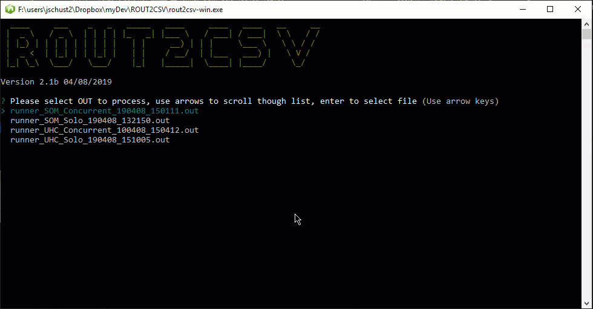

= Runner Output to CSV Convertor
John Schuster <John.schuster@PhoenixWorkgroup.com>
v2.1b, 04/08/2019: Developer
:Author: John HR Schuster
:Company:  Phoenix Workgroup
:toc: left
:toclevels: 4:
:imagesdir: ./
:pagenums:
:chapter-label: 
:experimental:
:experimental:
:source-highlighter: coderay
:icons: font
:docdir: */documents
:github: https://github.com/GeekMustHave/Github repository
:linkattrs:
:seclinks:
:title-logo-image: ./doco-cover.png

For doing automated testing of an API I have used a simple BASH script `runner.sh` that runs a CURL command for a number of requests against a list of beneficiaries.

The output from this `runner.sh` has *PHI* which needs to be de-identified and we are interested only extracting the errors.
An `Error` is identified when a Curl request returns a response with the `ErrorID` string in it.
We don't care about the type of error at this point.

A PDF version of this document is available at link:./readme.pdf[ Link,window='_blank']

== App Intro

This Runner Out to CSV will be written in Node.

The runner output look like this, which is the input to this utility.

.Runner output
----
*-- 1112234456 <1>
Mon, Apr 08, 2019  3:21:02 PM 

** plan <2>
Mon, Apr 08, 2019  3:21:02 PM <3>
  % Total    % Received % Xferd  Average Speed   Time    Time     Time  Current
                                 Dload  Upload   Total   Spent    Left  Speed
  0     0    0     0    0     0      0      0 --:--:-- --:--:-- --:--:--     0  0     0    0     0    0     0      0      0 --:--:-- --:--:-- --:--:--     0100   159  100   159    0     0    679      0 --:--:-- --:--:-- --:--:--   679

** summary API <2>
Mon, Apr 08, 2019  3:21:02 PM <3>
  % Total    % Received % Xferd  Average Speed   Time    Time     Time  Current
                                 Dload  Upload   Total   Spent    Left  Speed
  0     0    0     0    0     0      0      0 --:--:-- --:--:-- --:--:--     0100  1345  100  1345    0     0   4310      0 --:--:-- --:--:-- --:--:--  4310{"Message":"An unexpected error occured. Please report this error ID to MDHHS Admin.","ErrorDate":"2019-04-08T15:20:54.192301-04:00","ErrorID":378784,"ErrorMessage":"[.NET Data Provider for Teradata] [100002] Cannot create connection within the time specified. [InnerException]: Teradata.Client.Provider.TdException (0x80004005): [.NET Data Provider for Teradata] [100002] Cannot create connection within the time specified.\r\n   at System.Runtime.ExceptionServices.ExceptionDispatchInfo.Throw()\r\n   at Teradata.Client.Provider.WpTcpTransport.EndReceive(IAsyncResult asyncResult)\r\n   at Teradata.Client.Provider.WpSession.OnReceiveComplete(IAsyncResult asyncResult)\r\n--- End of stack trace from previous location where exception was thrown ---\r\n   at System.Runtime.ExceptionServices.ExceptionDispatchInfo.Throw()\r\n   at Teradata.Client.Provider.WpSession.EndReceive(IAsyncResult asyncResult)\r\n   at Teradata.Client.Provider.WpMessageManager.OnReceiveComplete(IAsyncResult asyncResult)\r\n--- End of stack trace from previous location where exception was thrown ---\r\n   at System.Runtime.ExceptionServices.ExceptionDispatchInfo.Throw()\r\n   at Teradata.Client.Provider.WpMessageManager.EndReceive(IAsyncResult asyncResult)\r\n   at Teradata.Client.Provider.WpStartRequestManager.OnStartRequestComplete(IAsyncResult asyncResult)"} <4>

** chronicconditions API <2>
Mon, Apr 08, 2019  3:21:03 PM <3>
  % Total    % Received % Xferd  Average Speed   Time    Time     Time  Current
                                 Dload  Upload   Total   Spent    Left  Speed
  0     0    0     0    0     0      0      0 --:--:-- --:--:-- --:--:--     0100   151  100   151    0     0    248      0 --:--:-- --:--:-- --:--:--   248100   151  100   151    0     0    248      0 --:--:-- --:--:-- --:--:--   248[{"BeneficiaryID":"0089035870","Conditions":"SEIZURE EPILEPSY","Last 6 Months":"          0","7-12 Months":"          2","13-18 Months":"          0"}]

** ipadmissions API <2>
Mon, Apr 08, 2019  3:21:04 PM <3>
  % Total    % Received % Xferd  Average Speed   Time    Time     Time  Current
                                 Dload  Upload   Total   Spent    Left  Speed
  0     0    0     0    0     0      0      0 --:--:-- --:--:-- --:--:--     0100     2  100     2    0     0      4      0 --:--:-- --:--:-- --:--:--     4[]
 
----
<1> Each new beneficiary starts with a `*--` followed by  the 10 digit beneficiary PHI number
<2> Each new Curl request starts with a `**` followed by the name of request
<3> The line after <2> is the time the request was started
<4> An example of a line with a `ErrorID` in it.

In the example above we want the following in a CSV format only when the Request has `ErrorID` in the response

. Run ID, question asked at start of program, String
. Server, another question with a pull down `SOM`, `UHC`
. Environment, another question will a pull down `QA`, `PROD`
. Runner type, another question `Concurrent` or `Solo`, new entries in future 
. Request name, in the example `summary`, drop the API
. Beneficiary ID, de-identified 3rd, 6th and 8th digits so `1112234456` is returned as `{134}`

An example of what the output from this utility is shown below.

NOTE: The output file will always be named ROUT.CSV

.ROUT2.CSV Output example
----

include::ROUT-example.CSV[Example CSV file]
----

== PHI Information

The Runner.out files used by this utility have PHI in them.
This utility needs to be capable of running from any directory, including the encrypted directories where the API test data is kept.

== Node and JavaScript

Currently the Node version is 8.x.x but, the final version needs to work in 10.x.x

When ever possible the newer ES6, also known as ES2015 JavaScript syntax will be used.

== User Interface

I have been very happy when developing CLI NODE app's in using the following libraries

* Chalk - Terminal string styling done right
* clear - Clear the terminal screen if possible
* figlet - Creates ASCII Art from text. A full implementation of the FIGfont spec.
* inquirer - A collection of common interactive command line user interfaces.

These will all be installed with NPM and the `--save` option to put dependicies in the package.json file.

 npm install --save chalk clear figlet inquirer

== Reading files

IN past experiments I have read files into a sting in the app and read through the string.
The OUT files here can be quite large as the number of request and test set expands.

The alternative is a module `line-reader`, Asynchronous, buffered, line-by-line file/stream reader with support for user-defined line separators.

  npm install --save line-reader

The eachLine function reads each line of the given file. Upon each new line, the given callback function is called with two parameters: 
the line read and a boolean value specifying whether the line read was the last line of the file. 
If the callback returns false, reading will stop and the file will be closed.

== Logic

. Look for '*-- beneficiary number', save it
. Look for '** request API', save it
. Read next line save date
. Look for `ErrorID`
. If found write a CSV row out

== Compiling ROUT2CSV

The index.js can be compiled into an windows/linux/Mac OS executable by using `pkg'

`pkg` This command line interface enables you to package your Node.js project into an executable that can be run even on devices without Node.js installed.

`pkg` can be installed with the following command

  npm install -g pkg

To prepare the compile to use the `assets` required there is one `figlet` item that needs tro be added to the `package.jsom` file.

Add after the `MAIN` definition

.Additional package.json
----
  "bin": "./index.js",
    "pkg": {
      "assets": "./node_modules/figlet/fonts/Standard.flf"
    },
----

Now to compile the utility perform

  pkg package.json

This will generate an executable for Window, Mab and Linux

* rout2csv-linux - Linux edition
* rout2csv-macos - Mac OS
* rout2csv-win.exe - Windows Edition edition

== Demo

The following is a demostration of the ROUT2CSV.

NOTE: The PDF will not display the demo.

== Document History

[cols="2,2,2,6", options="header"]
.Document History
|===
| Date | Version | Author | Description
| 03/08/19 | V2.1b | JHRS | initial version of utility with EXE's
|===